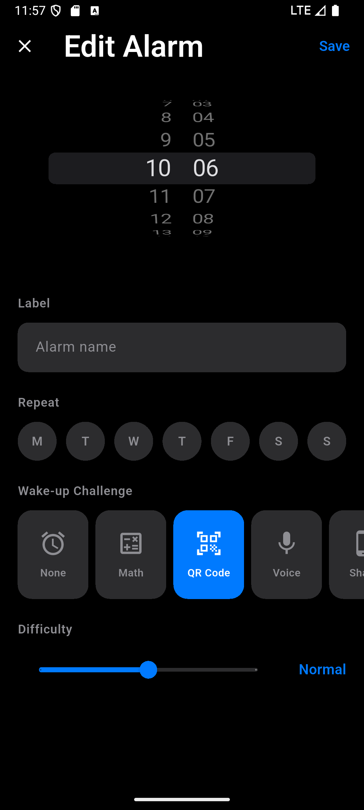
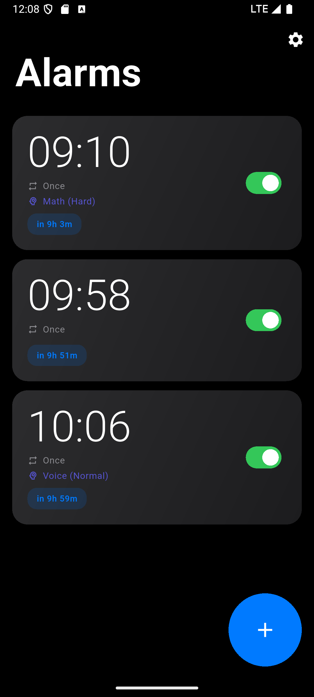

# Next Alarm

[English](README.md)

この README は日本語版です。正本は [README.md](README.md) です。

[](https://flutter.dev/)
[](#現在のスコープ)
[](LICENSE)

Next Alarm は、普通のアラームでは起きられない人のための、モバイルファーストな目覚ましアプリです。
かわいい通知アプリを目指しているのではなく、眠りから覚醒へ状態を切り替えるための道具を目指しています。

## このプロジェクトの考え方

多くの目覚ましアプリは「時刻を設定する」ことには強いですが、「実際に起きる」ことまでは面倒を見てくれません。
Next Alarm は、その境界を越えるためのプロダクトとして作っています。

方向性は、次の 3 点で整理できます。

- 信頼性を新規性より優先すること。必要なときに鳴らなければ、アラームの価値はありません。
- 意味のある摩擦を設計すること。覚醒チャレンジは遊びではなく、起きるための現実的な行動です。
- 実用品でも、落ち着いた UI と使い心地を諦めないこと。毎日使うものだからこそ、雑にしたくありません。

## 現在のスコープ

このリポジトリは、意図的にスマホアプリへ集中しています。
以前のブラウザ版と GitHub Pages デプロイは、プロダクトの焦点と保守範囲を明確にするために整理しました。

現在の主戦場は Android です。iOS プロジェクトは含まれていますが、アラームの信頼性まわりはまだ Android 優先です。

## 主な機能

- 曜日ごとの繰り返し設定に対応した無制限アラーム
- 覚醒チャレンジ: なし / 計算 / 音声認識 / シェイク / 歩数
- チャレンジ難易度、アラーム音、振動強度、徐々に音量を上げる設定
- フルスクリーンのアラーム導線
- 日本語 / 英語のローカライズ
- Android ネイティブ連携によるアラームスケジューリングとロック画面寄りの挙動

## スクリーンショット

| ホーム | アラーム編集 | 設定 |
| --- | --- | --- |
|  |  |  |

## 技術スタック

- Flutter
- Dart
- Provider
- SharedPreferences
- flutter_local_notifications
- speech_to_text
- sensors_plus
- pedometer
- vibration

## ディレクトリ構成

```text
lib/
  models/      アラームやチャレンジ設定などのドメインモデル
  screens/     ホーム、編集、鳴動、設定画面
  services/    アラーム制御、更新確認、画面遷移、プラットフォーム連携
  theme/       テーマとデザイントークン

android/       Android アプリ本体とネイティブアラーム実装
ios/           iOS アプリ本体
scripts/       リリース補助スクリプト
screenshots/   README 用スクリーンショット
docs/          リリースノートや調査メモ
```

## 開発の始め方

### 前提

- リポジトリの `pubspec.yaml` に合う Flutter SDK
- Android Studio または Xcode
- Android SDK
- iOS をビルドする場合は Xcode

### ローカル実行

```bash
git clone https://github.com/MiUPa/nextAlarm.git
cd nextAlarm
flutter pub get
flutter run
```

### ビルド

```bash
# Android APK
flutter build apk --release

# Android App Bundle
flutter build appbundle --release

# Play リリース補助
./scripts/release_android_playstore.sh build

# iOS (macOS のみ)
flutter build ios --release
```

## コントリビュート

Issue と Pull Request を歓迎します。

変更を入れるときは、次の方向性を共有したいです。

- 新しさよりも、実際に起きられる信頼性を優先する
- リポジトリはモバイル専用を維持し、ブラウザ版のスコープは増やさない
- 摩擦を増やすなら、なぜその体験が覚醒に効くのかを説明できるようにする

## 今後の方向

- より多くの Android 端末で信頼性診断を強化する
- スケジューリングと鳴動フローの自動テストを増やす
- iOS の挙動を Android に近づける
- 覚醒チャレンジの調整幅を広げる

## ライセンス

MIT. 詳細は [LICENSE](LICENSE) を参照してください。
